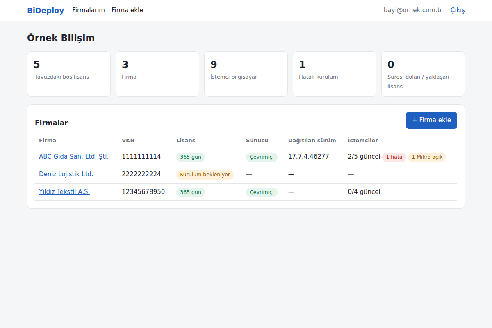
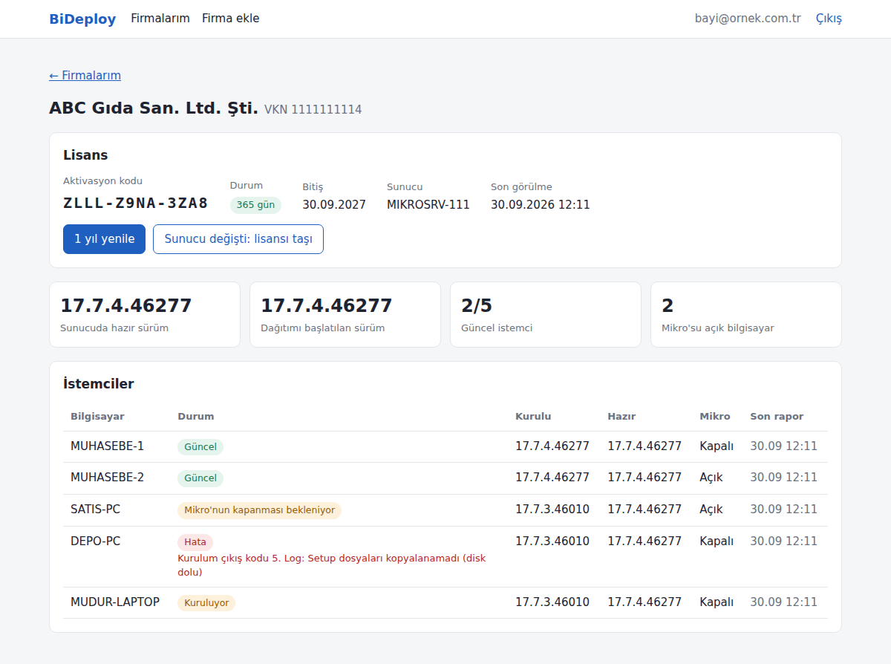
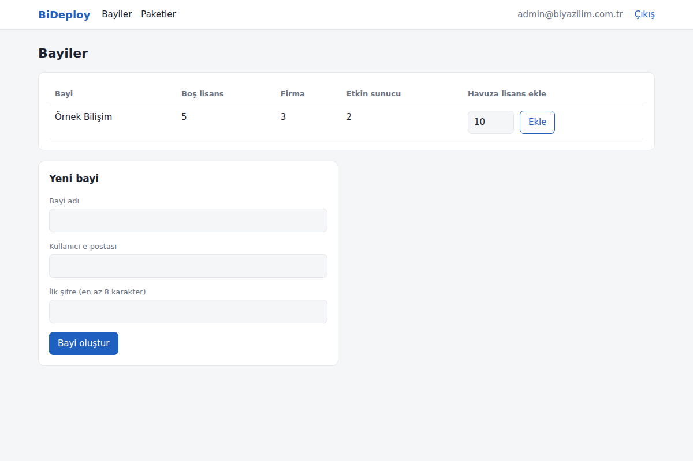

# BiDeploy

Mikro Yazılım bayileri için istemci güncelleme dağıtım sistemi. Mikro sunucusu güncellendiğinde tüm istemci
bilgisayarlar, önceden indirilmiş imzalı setup ile aynı anda ve sessizce güncellenir.

```
  BiYazılım ──(yayıncı aracı: imzala + yükle)──▶  VPS (API, lisans havuzu, paket deposu)
  Bayi ──(müşteri/VKN, lisans, durum)──────────▶        ▲
                                                         │ internet (bağlantıyı hep ajan başlatır)
                                   Sunucu ajanı (Mikro sunucusu, VKN başına 1 lisans)
                                                         │ yerel ağ (paket 1 kez indirilir, LAN'dan dağıtılır)
                                   İstemci ajanı   İstemci ajanı   İstemci ajanı
```

## Güncelleme akışı

1. BiYazılım yeni setup'ı `bideploy-publish` ile imzalayıp VPS'e yükler. Sürüm exe'nin FileVersion değerinden,
   ürün ve mimari dosya adından (`Fly_v17xx_Client_Setupx064.exe` → Fly / x64) otomatik okunur.
2. Sunucu ajanı yeni paketi VPS'ten bir kez indirir; istemciler yerel ağdan kendi diskine çeker. **Kurulum yapılmaz.**
3. Bayi Mikro sunucusunu elle günceller.
4. Bayi hazır olduğunda `BiDeploy.Agent.exe release` ("İstemcileri Güncelle") komutunu verir; önceden indirilen paket
   istemcilere serbest bırakılır. Ne zaman kurulacağına bayi karar verir, sistem Mikro'nun kurulu sürümünü okumaz.
5. İstemcide Mikro açıksa kullanıcılar uyarılır (`msg *`, terminal server oturumları dahil), süre dolunca
   `MikroFly.exe` kapatılır ve setup `/VERYSILENT /SUPPRESSMSGBOXES /NORESTART /SP- /CLOSEAPPLICATIONS` ile kurulur.
6. Sonuç sunucu ajanına, oradan VPS'e raporlanır; bayi `GET /api/dealer/companies` ile görür.

## Web paneli

Sunucu tarafında render edilen Türkçe panel (e-posta + şifre ile giriş).

- **Bayi** (`/Panel`): firma ekleme (VKN/TCKN doğrulamalı), havuzdan lisans atama, aktivasyon kodu, yıllık yenileme,
  sunucu değişiminde lisans taşıma; her firmanın sunucusunun çevrimiçi olup olmadığı, dağıtılan sürüm ve her istemcinin
  durumu (güncel / Mikro'nun kapanması bekleniyor / hata + kurulum logu).
- **BiYazılım** (`/Yonetim`): bayi ve bayi kullanıcısı oluşturma, havuza lisans yükleme, yayınlanan paketler ve geri çekme.
- İlk yönetici hesabı `BiDeploy__InitialAdminEmail` / `BiDeploy__InitialAdminPassword` ile oluşturulur (hiç yönetici yoksa).
- Bir bayi başka bayinin firmalarını göremez. Saatler Türkiye saatiyle gösterilir.

| Bayi: firmalar | Bayi: firma detayı | BiYazılım: bayiler |
|---|---|---|
|  |  |  |

## Güvenlik

- Her paketin manifesti (sürüm, SHA-256, kurulum parametreleri) BiYazılım'ın **RSA-3072** özel anahtarıyla imzalanır.
  Ajan, exe'ye gömülü açık anahtarla imzayı ve dosya özetini doğrulamadan hiçbir şey kurmaz. VPS ele geçirilse bile
  müşterilere sahte paket kurdurulamaz; bayiler de başka exe dağıtamaz.
- Özel anahtar sadece yayıncı bilgisayarında durur (`*.key.json` git'e girmez).
- İstemci hangi paketi kurduğunu kendisi kaydeder, aynı paketi iki kez kurmaz; hatalı kurulumu 15 dk sonra yeniden dener.
- Bayi anahtarları ve cihaz jetonları veritabanında yalnızca özet olarak tutulur.
- Lisans bitse de müşterinin Mikro'su etkilenmez; sadece yeni sürüm dağıtımı durur.

## Projeler

| Proje | Hedef | Açıklama |
|---|---|---|
| `BiDeploy.Core` | netstandard2.0 | Manifest, imza, VKN/TCKN doğrulama, protokol modelleri |
| `BiDeploy.Agent.Core` | netstandard2.0 | Ajan mantığı: paket önbelleği, sunucu/istemci döngüleri, yerel ağ sunucusu |
| `BiDeploy.Agent` | .NET Framework 4.8 | Windows servisi + CLI (Server 2012 R2 – Windows 11) |
| `BiDeploy.Server` | .NET 10 | VPS API + web paneli (ASP.NET Core Razor Pages, PostgreSQL / geliştirmede SQLite) |
| `BiDeploy.Publisher` | .NET 10 | Yayıncı aracı (`bideploy-publish`) |
| `BiDeploy.Tests` | .NET 10 | Uçtan uca akış dahil testler |

## Başlangıç

```bash
dotnet test                                    # tüm testler

# 1) Yayıncı anahtarı (bir kez, BiYazılım bilgisayarında)
dotnet run --project src/BiDeploy.Publisher -- keygen --out keys
cp keys/publisher.pub.json src/BiDeploy.Agent/trusted-publisher.pub.json   # ajana gömülür

# 2) VPS (geliştirme) → http://localhost:5000/Giris
BiDeploy__AdminKey=gizli BiDeploy__InitialAdminEmail=admin@firma.com BiDeploy__InitialAdminPassword=Sifre-1234 \
    BiDeploy__PublisherPublicKeyPath=keys/publisher.pub.json dotnet run --project src/BiDeploy.Server
#    Üretim: .env içinde DOMAIN, BIDEPLOY_ADMIN_KEY, POSTGRES_PASSWORD, ADMIN_EMAIL, ADMIN_PASSWORD → docker compose up -d

# 3) Paket yayınla
bideploy-publish publish Fly_v17xx_Client_Setupx064.exe --key keys/publisher.key.json \
    --server https://deploy.ornek.com.tr --admin-key gizli
```

Ajan: `agent.sample.json` dosyasını `agent.json` olarak exe'nin yanına koyun, sunucuda
`BiDeploy.Agent.exe activate <KOD> <VKN>` çalıştırın, ardından servis olarak kurun (`BiDeploy.Agent.exe` yardım çıktısına bakın).

### API özeti

| Kim | Uç |
|---|---|
| BiYazılım (`X-Admin-Key`) | `POST /api/admin/dealers`, `POST /api/admin/dealers/{id}/licenses`, `POST /api/admin/packages`, `POST /api/admin/packages/{id}/withdraw` |
| Bayi (`X-Api-Key`) | `GET /api/dealer/me`, `POST/GET /api/dealer/companies`, `POST /api/dealer/companies/{id}/license` (`/renew`, `/transfer`) |
| Sunucu ajanı (`Bearer`) | `POST /api/agent/activate`, `GET /api/agent/packages/latest`, `GET /api/agent/packages/{id}/file`, `POST /api/agent/report` |

## Sıradaki adımlar

- Başlatıcı (Mikro kısayolu: güncelleme bitmeden eski istemciyi açtırmaz)
- Tepsi uygulaması / sunucu ekranı ("İstemcileri Güncelle" butonu, kimde Mikro açık listesi)
- MSI kurulum paketi, Windows Firewall kuralı, ajanın kendini güncellemesi
- EF Core migration'ları, lisans bitiş uyarıları (e-posta), kod imzalama sertifikası
